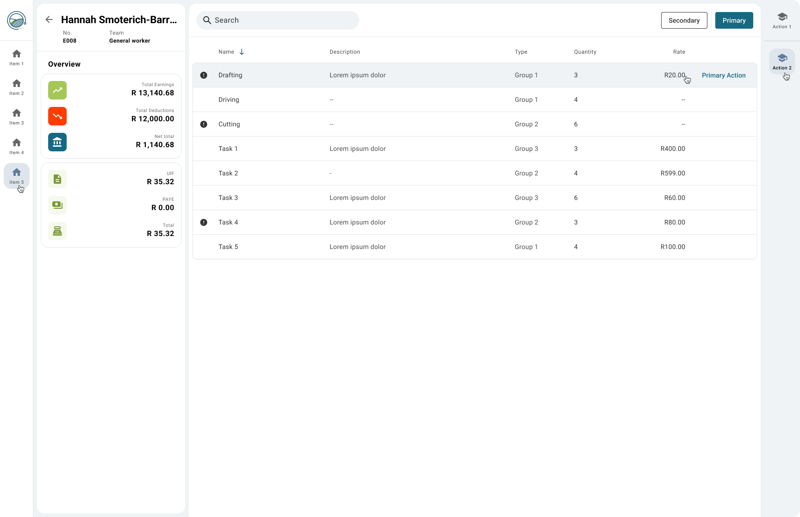

# Modern Payroll Dash
A payroll view for employees, including total earnings and a summarised view, presented in a detailed table view format. Using JSON mock data.

## Challenge
This repo acts as a coding assessment. The goal is to complete as much as possible within a 3 hour window.

## Design
As provided via the test provider, this is the design we will be implementing:

## Code
This project is written using latest Angular (20.3.3 currently).
We can access the code directory from your code editor/IDE via using the terminal and executing: `cd ng-payroll`.

Once inside the code directory - we can look to the 2nd [README.md](./ng-payroll/README.md) file to get a better understanding of how to run this code locally etc.